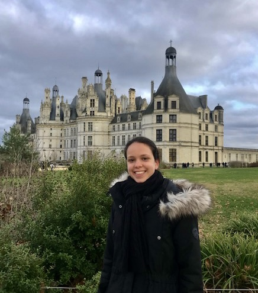

&nbsp; &nbsp; &nbsp; &nbsp; **Quanling Deng**

&nbsp; &nbsp; &nbsp; &nbsp; Group leader

&nbsp;
&nbsp;
&nbsp;
&nbsp;
&nbsp;
&nbsp;
&nbsp;
&nbsp;
&nbsp;
 
 
 
 
 

* * * 

&nbsp; &nbsp; &nbsp; &nbsp; **Danyang Li**

&nbsp; &nbsp; &nbsp; &nbsp; Master Student

&nbsp; &nbsp; &nbsp; &nbsp; Finite element methods

&nbsp; &nbsp; &nbsp; &nbsp; Soft isogeometric analysis

&nbsp; &nbsp; &nbsp; &nbsp; Numerical methods for differential eigenvalue problems

&nbsp; &nbsp; &nbsp; &nbsp; [Submitted paper arXiv preprint](https://arxiv.org/abs/2210.06832)

 
 
 

* * * 

&nbsp; &nbsp; &nbsp; &nbsp; **Anousheh Moonen**

&nbsp; &nbsp; &nbsp; &nbsp; PhB(Hons) Student 

&nbsp; &nbsp; &nbsp; &nbsp; Inverse Problems

&nbsp; &nbsp; &nbsp; &nbsp; Neural Network

 
 
 
 
 
 

* * * 
**Former Students**
* * *

&nbsp; &nbsp; &nbsp; &nbsp; **Diwen Chen**

&nbsp; &nbsp; &nbsp; &nbsp; Master Student

&nbsp; &nbsp; &nbsp; &nbsp; Antarctic sea ice

&nbsp; &nbsp; &nbsp; &nbsp; Neural Network (IceNet)

 
 
 
 
 

* * * 

&nbsp; &nbsp; &nbsp; &nbsp; **Liam Harcombe**

&nbsp; &nbsp; &nbsp; &nbsp; PhB(Hons) Student 

&nbsp; &nbsp; &nbsp; &nbsp; Eigenvalues of differential operators

&nbsp; &nbsp; &nbsp; &nbsp; Neural Network (PINN)

 
 
 
 
 
 
 

* * * 
