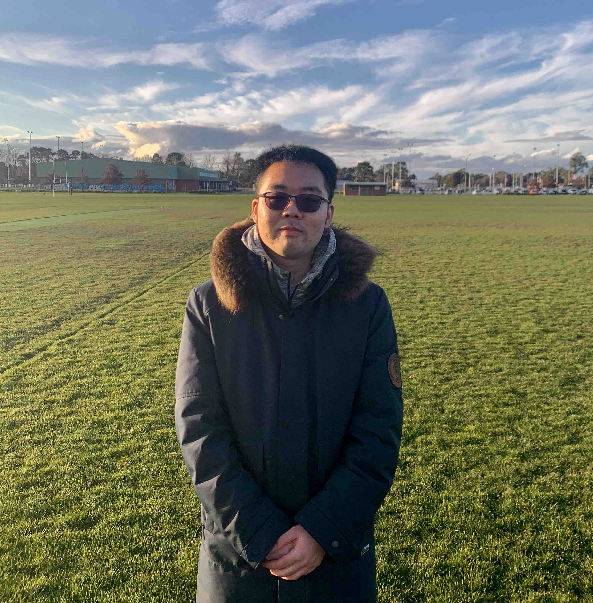
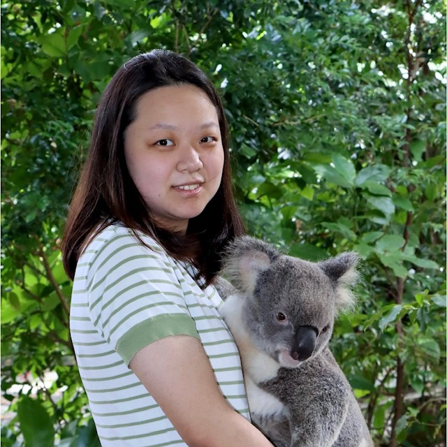

### Quanling Deng

Group leader

&nbsp;
&nbsp;
&nbsp;
&nbsp;
&nbsp;
&nbsp;
&nbsp;
&nbsp;
&nbsp;
 
 
 

* * * 

## Diwen Chen

* Master Student

- Antarctic sea ice
- Neural Network (IceNet)

* * * 

<table class="fixed">
  <col width="200"/>
  <col width="200"/>
  <col width="200"/>
  <tr>
    <td> <!-- Quanling Deng -->
        

          <!-- a href="https://quanlingdeng.github.io/" title="" class="card-image hover-overlay" target="_blank" -->
          
          <!-- </a>  -->
          

            <!-- 
Quanling Deng
 --->
            <h4><a href="https://quanlingdeng.github.io/" target="_blank">Quanling Deng</a></h4>
            

              
Group Leader

            

          

        

    </td>
    <td> <!-- Diwen Chen -->
        

          
          <!-- </a>   -->
          

            
Diwen Chen

            <!-- <h4><a href="" target="_blank">Diwen Chen</a></h4> -->
            

              
Master Student   Sea Ice, Neural Network 

            

          

        

    </td>
 <tr>
    <td> <!-- Danyang Li -->
        

          <!-- <a href="" title="" class="card-image hover-overlay" target="_blank"> -->
          
          <!-- </a>   -->
          

            
Danyang Li

            <!-- <h4><a href="" target="_blank">Danyang Li</a></h4> -->
            

              
Master Student   SoftIGA, Neural Network 

            

          

        

    </td>
    <td> <!-- Anousheh Moonen -->
         

            
            <!-- </a>   -->
            

            
Anousheh Moonen

            <!-- <h4><a href="" target="_blank">Anousheh Moonen</a></h4> -->
            

                
PhB(Hons) Student   Neural Network, Inverse Problems 

            

           

         

       </td>
 </tr>

 <tr>
    <td> <!-- Liam Harcombe -->
        

          
          <!-- </a>   -->
          

            
Liam Harcombe

            <!-- <h4><a href="" target="_blank">Liam Harcombe</a></h4> -->
            

              
PhB(Hons) Student   Neural Network, Eigenvalues 

            

          

        

    </td>
 </tr> 
</table> 
