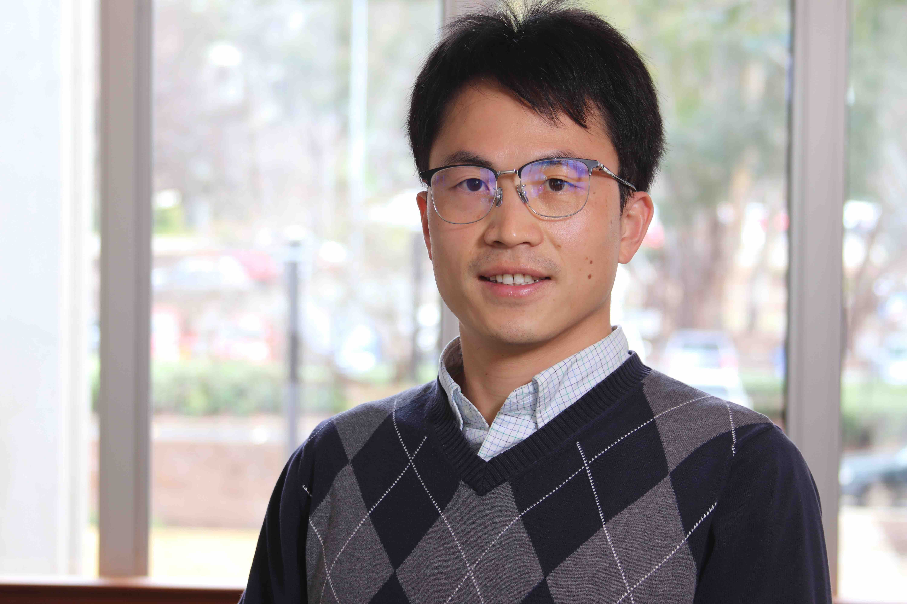

<!-- Machine artificial intelligence -> Human intelligence as time -> infinity, but the space of AI is not [Cauchy complete](https://en.wikipedia.org/wiki/Complete_metric_space). Welcome to my webpage! -->

[Quanling Deng](https://ymsc.tsinghua.edu.cn/en/info/1033/3472.htm)  
Assistant Professor    
[Yau Mathematical Sciences Center](https://ymsc.tsinghua.edu.cn/)     
[Tsinghua University](https://www.tsinghua.edu.cn/)        
Beijing, China      
Office: Shuangqing Complex Bldg. B523           
Email:  qlLastname@tsinghua.edu.cn  

Honorary Lecturer   
[School of Computing](https://comp.anu.edu.au/people/quanling-deng/)  
[Institute for Climate, Energy & Disaster Solutions](https://iceds.anu.edu.au/people/academic-members/quanling-deng#acton-tabs-link--tabs-person_tabs-middle-1)                                       
[Australian National University](https://www.anu.edu.au/)     
Canberra, ACT, Australia     
Email: Firstname.Lastname@anu.edu.au   

I am currently looking for postdoctoral researchers to join my research group at the 
<a href="https://ymsc.tsinghua.edu.cn/">Yau Mathematical Sciences Center (YMSC)</a>, 
<a href="https://www.tsinghua.edu.cn/">Tsinghua University</a>, Beijing, China. 
The research focuses on data assimilation combined with AI/ML, with possible directions also involving 
quantum computing and modeling, applied to sea-ice and climate system modeling. 
The position offers a competitive salary starting from 350,000+ RMB per year. 
Interested candidates should apply through 
<a href="https://www.mathjobs.org/jobs/list/26588">MathJobs</a> and please indicate me as your supervisor in your application.

## A brief bio
Born in Hunan, Dr. Quanling Deng currently holds a tenure-track Assistant Professor position at YMSC and an honorary Lecturer position at ANU. Before joining YMSC, he worked at ANU as a Lecturer (2022-2025), at the University of Wisconsin-Madison as a Van Vleck Visiting Assistant Professor (2020-2022), and at Curtin University as a Research Associate (2016-2020). He got his PhD in Mathematics at the University of Wyoming in 2016. He has a broad interest in Artificial Intelligence, Computational and Applied Mathematics.

<!-- Dr. Quanling Deng is a Lecturer at the ANU School of Computing. He was born in Hunan, China and moved to the USA to study mathematics in August 2011. He graduated with a Ph.D. in computational mathematics with a topic on finite element analysis at the University of Wyoming in May 2016. He then joined Curtin University in Australia as a research associate and mainly contributed to the development of isogeometric analysis. He was a short-term visiting scholar at INRIA Paris, AGH University of Science and Technology in Poland, École des Ponts ParisTech (ENPC), USTC, and others. In March 2020, he joined the Department of Mathematics at the University of Wisconsin-Madison as a Van Vleck visiting assistant professor and worked on modelling and prediction of Arctic sea-ice dynamics. Dr. Deng has authored 35+ peer-reviewed publications. Also, he has given 15+ invited presentations and 20+ contributed talks at conferences and seminars and organised five mini-symposia at international conferences. -->

* * *
#### Personal hobbies
- [Badminton](https://quanlingdeng.github.io/bady.html)
- [ANU Fibonacci Trees](https://quanlingdeng.github.io/fibo.html)
- [Hiking](https://quanlingdeng.github.io/hiking.html)

