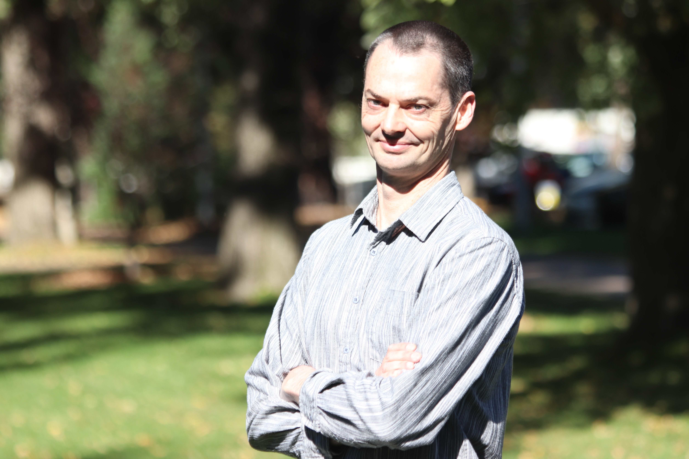

<iframe width="660" height="365" src="https://www.youtube.com/embed/ZwaHX23LhBI" title="YouTube video player" frameborder="0" allow="accelerometer; autoplay; clipboard-write; encrypted-media; gyroscope; picture-in-picture" allowfullscreen></iframe>

The Jubilee Joint Fellowship (JJF) celebrates 50 years of computer science teaching at ANU. Each Fellowship is a unique three-year appointment, engaging in interdisciplinary and multidisciplinary research at the forefront of computing, while addressing major challenges in science, health and society. 

Fellows will be working across the schools of computer science, astronomy and astrophysics, earth sciences, and biological data and medical institutes on projects ranging from using genomic data to better identify patterns of pathogenic genetic variation in complex human diseases, to harnessing time-series data for almost 37 billion objects in the cosmos to discover rare, exotic objects and new phenomena.   

## Meet the Fellows 

<table class="fixed">
  <col width="400"/>
  <col width="400"/>
  <tr>
    <td> <!-- Dan Andrews -->
        

            
          

            
Dr Dan Andrews

            <!-- <h4><a href="" target="_blank">Dr Dan Andrews</a></h4> -->
            

              
Partnering School: John Curtin School of Medical Research

            

          

        

    </td>
    <td> <!-- Dr Iona (Jo) Ciuca -->
        

            
          

            
Dr Iona (Jo) Ciuca

            <!-- <h4><a href="" target="_blank">Dr Iona (Jo) Ciuca </a></h4> -->
            

              
Partnering school: Research School of Astronomy and Astrophysics

            

          

        

    </td>
 </tr>
 <tr>
    <td> <!-- Dr Rhys Hawkins -->
        

            
          

            
Dr Rhys Hawkins

            <!-- <h4><a href="" target="_blank">Dr Rhys Hawkins</a></h4> -->
            

              
Partnering School: Research School of Earth Sciences

            

          

        

    </td>
     <td> <!-- Dr Brian Parker -->
        

            
          

            
Dr Brian Parker

            <!-- <h4><a href="" target="_blank">Dr Brian Parker</a></h4> -->
            

              
Partnering School: Biological Data Science Institute

            

          

        

    </td>   
 </tr>
 <tr>
    <td> <!-- Dr Michael McCullough -->
        

            
          

            
Dr Michael McCullough

            <!-- <h4><a href="" target="_blank">Dr Michael McCullough</a></h4> -->
            

              
Partnering School: Eccles Institute (John Curtin School of Medical Research)

            

          

        

    </td>
 </tr>
</table> 
