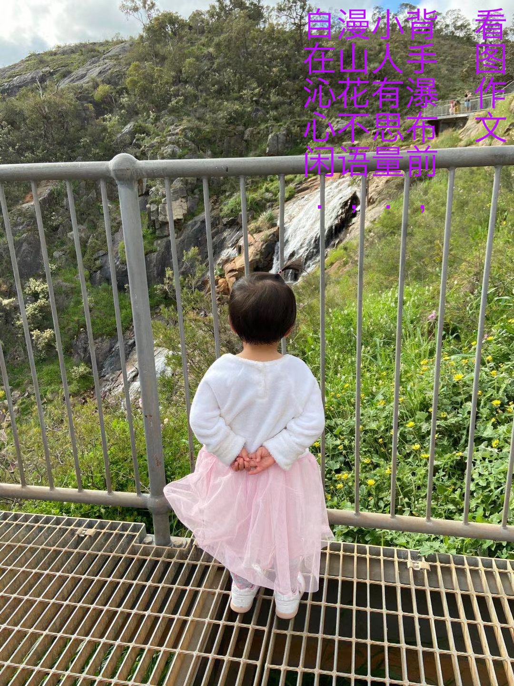
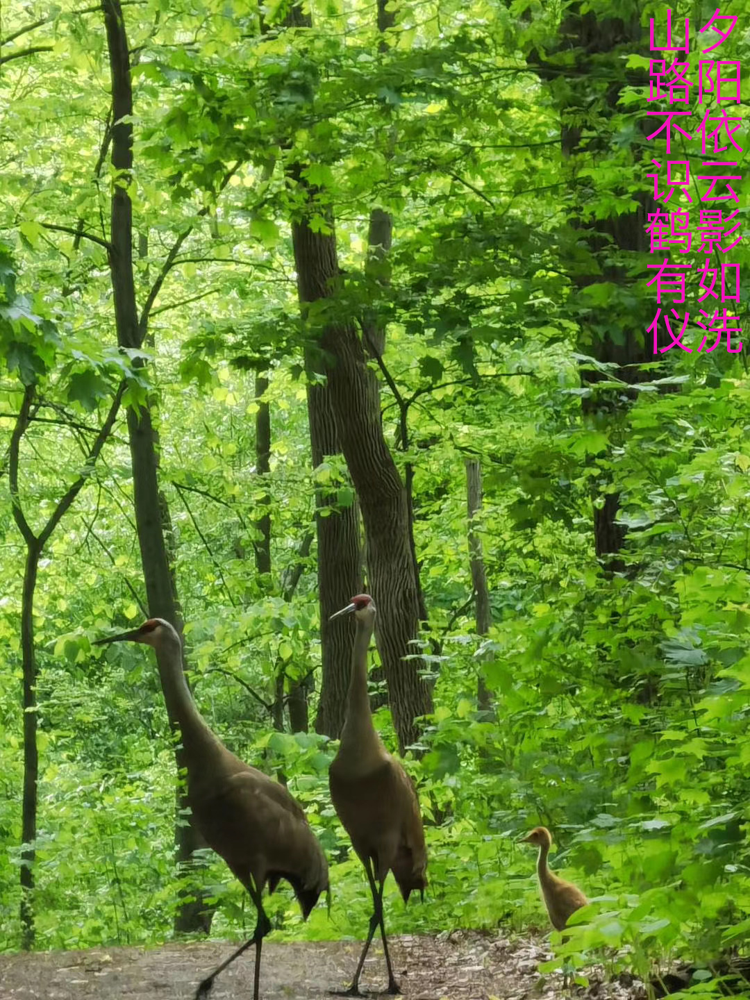

## An English poem written in 2007:

    
**I Am A Bird**

    
I am a bird flying in the sky  
I can do nothing but go high  
Whenever there is a rain  
Wherever there is a pain  
I am always the bird not only go by  

* * * 

## Some Chinese poems are listed below: 

**新问**

连日秋雨始放晴 ，  
极目远眺始登顶。  
何处山川不平等？  
何处天下不太平？  

何求天下不识君？  
何求宇霸不是人？  
东风拟把山扫尽，  
一马平川换天新！  

虎年三月于堪培拉

* * * 

**月夜寄怀**

缺月追云水面浮，  
水平一线此山孤。  
虫鸣蛙叫声声慢，  
半说风云半说无。  

***

**ANU Computing五十周年**

五十年来不寻常，  
为谁辛苦为谁忙？  
丰功伟绩细细数，  
百年回首更辉煌！

虎年五月  
于堪培拉  
（虎初入职，幸逢庆典，群贤毕至，少长咸集。   
情同兰亭，“世殊事异，所以兴怀，其致一也”  
偶得几句，略表盛况。）

***

**致母亲**

树有青山雁有巢，  
碧水悠悠是母情。  
最是三春无所报，  
游子寸心求好音。  

虎年三月  
堪村颓笔   
（南北半球，相去甚远，次子不孝，无近侍养。  
不类兄长，近国殷勤，亦不类妹，购物寄情。  
黍稷离离，赤心权权，酝酒酿诗，托月以寄。  
陈情之表，于密不及。唯遥祝母，康乐愉年！）

***
**写给波尔图的六座桥**

什么时候什么样的人  
走过什么样的路  
修出什么样的桥  

又有什么样的人  
从什么样的地方来  
跨过桥到什么样的地方去  

一九年六月  
于葡萄牙波尔图

***

**一**

一人一影一行囊  
一街一驹一阳光  
一海鸥一教堂  
一广场  
一驻足、一酒馆  

伏特加也好  
帕利科托夫卡也好  
形骸之外  
微微一笑  
整个城市都是妳的  

一九年五月十二日  
于波兰克拉科夫  

***

**就像**

就像  
蓝蓝的天空  
白白的云  

就像  
轻轻的暖风  
潺潺的流水  

就像  
匆匆的夕阳  
不经意间的三秋  

就像  
我中有妳  
妳中有我  
就像，从此  

2018年2月14日于Curtin

***
**无题**

写不出诗的日子  
等一个灵感  
落在我的指尖  

***
**致妹妹**

南方有娇龙，  
灵动而独立。  
一朝腾云去，  
青云九万里！ 

二一年七月于珀斯  
（吾妹今日抵达波士顿，入职MIT，  
二哥以她为豪，替她高兴，特记！）

***
**致妹**

南燕生南国，嘻嘻到十八。  
哈哈去求学，谆谆学无涯！  
窃窃自勉励，麻省顶呱呱。  
呱呱坠地日，辛苦是咱妈！  

二一年十月于珀斯  
（遥祝妹妹生日快乐）

***
**游记**

去年今日此山中，  
春游一行人不同。  
漫山野花窃窃语，  
去年不曾见此公！  

10/07/2021一行人同游近郊瀑布

***
**游记**

风影入水无，  
静挂万年松。  
无忌小儿语，  
云动坠湖中。  

21年8月于珀斯  
（曼达伦大坝一游，泽怡语出惊人，云：  
云掉入湖中！  
吾以为趣，特此一记。）

***
**无题**

把妳那无处安放的青春  
捧在手心  
吹到风里  
落了雨  
来了  
一群鸟儿  
叼了去了远方  
去了那梦想的港湾  

***
**无题**

来中科大那天  
四月一号  
樱花正好开了  
于是  
我短期的访问  
弥漫着淡淡花香  

三号那天  
朋友带去划龙舟  
从此  
我的心里  
住了一条不一样的中国龙  

六号那天  
去打了羽毛球  
结识了一位朋友  
吃了地锅鸡还有后来的夜宵  
看了南门的郁金香  

九号那天下雨了  
冒着雨去看樱花  
晨雨过处  
一地残红  

十二号那天  
离别  

一九年四月
于合肥

***

## Several Chinese poems embedded in photos

 
 
 
 
 
     

