## Research interests
- Applied Mathematics and Applied Machine Learning: Sea ice floe dynamics, ocean and atmosphere dynamics,  deep neural networks, physics-informed neural networks, U-net, feature selection/interaction

- Uncertainty Quantification and Data Assimilation: stochastic models, Ornstein-Uhlenbeck process, Kalman filters, conditional Gaussian filter, Lagrangian and Eulerian data assimilation

- Scientific Computing and Computational Mathematics: parallel computing, preconditioners, post-processing, PDE numerical solvers such as FDM, FVM, FEM, IGA, DG, HHO, Runge--Kutta methods, and generalized-alpha methods, operator splitting schemes, dispersion and spectral analysis, a priori and a posteriori error analysis.

## Publications 
- See [Google Scholar Profile](https://scholar.google.com/citations?user=PBGaQ44AAAAJ&hl=en), or
- See [ResearchGate Profile](https://www.researchgate.net/profile/Quanling-Deng)

## Most recent work 
- [LEMDA: A Lagrangian-Eulerian Multiscale Data Assimilation Framework](https://arxiv.org/abs/2401.18048)
- [Exploring the cloud of feature interaction scores in a Rashomon set](https://arxiv.org/abs/2305.10181), ICLR 2024
- [Particle-Continuum Multiscale Modeling of Sea Ice Floes](https://epubs.siam.org/eprint/NXPIP7Z6PJXBYE3APWKM/full), SIAM MMS
- Fault-tolerant Parallel Multigrid Method on Unstructured Adaptive Mesh, SIAM Journal on Scientific Computing

## A talk given at [COSIMA Meeting](https://cosima.org.au/): 
- [LEMDA: A Lagrangian-Eulerian multiscale data assimilation tool for ice floe dynamics](https://www.youtube.com/watch?v=emgUdA3wVXI&ab_channel=COSIMA)
- <iframe width="560" height="315" src="https://www.youtube-nocookie.com/embed/emgUdA3wVXI?si=BTnFf_IHknBQUpJi&amp;start=111" title="YouTube video player" frameborder="0" allow="accelerometer; autoplay; clipboard-write; encrypted-media; gyroscope" allowfullscreen></iframe>

## A talk given at ANU [MSI MACS](https://maths.anu.edu.au/news-events/event-series/mathematics-and-computational-sciences-seminar): 
- [Superparameterisation of Arctic sea ice floes](https://maths.anu.edu.au/news-events/events/superparameterisation-arctic-sea-ice-floes)
<iframe width="800" height="450" src="https://www.youtube.com/embed/2faQpkqomZU" title="YouTube video player" frameborder="0" allow="accelerometer; autoplay; clipboard-write; encrypted-media; gyroscope; picture-in-picture" allowfullscreen></iframe>

## Several research lines

* * *
**Development of FEM approximations**

(1) A FEM approximated solution lacks the local conservation property on its fluxes. We propose a simple and efficient postprocessing technique to recover the locally conservative fluxes on control volumes (FEM dual mesh elements). The technique solves an elemental Neumann-boundary value problem and it can be naturally implemented in a parallel environment. See below the figures for control volumes for rectangular and triangular elements. See [this paper](https://www.sciencedirect.com/science/article/pii/S0377042719301803) for details. 

<table class="fixed">
  <col width="200"/>
  <col width="200"/>
  <tr>
    <td> 
        

          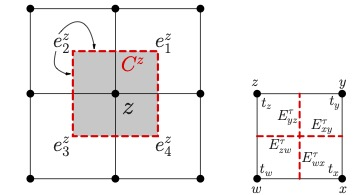 
        

    </td>
    <td> 
        

          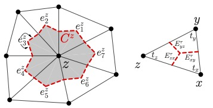 
        

    </td>
 </tr>
</table> 
  
  
(2) Quadratic and higher-order FEMs suffer from high stiffness (large condition numbers) in their discretised systems. We propose to reduce the stiffness of the problem by subtracting a least-squares penalty on the gradient jumps across the mesh interfaces from the standard stiffness bilinear form. The two key advantages of softFEM over the standard Galerkin FEM are to improve the approximation of the eigenvalues in the upper part of the discrete spectrum and to reduce the condition number of the stiffness matrix. The resulting approximation technique is called softFEM since it reduces the stiffness of the problem. See below a figure which compares the quadratic softFEM with FEM on spectral and eigenstate errors. See [this paper](https://www.sciencedirect.com/science/article/pii/S0898122121003382) for details. 

<table class="fixed">
  <col width="600"/>
  <col width="300"/>
  <tr>
    <td> 
        

          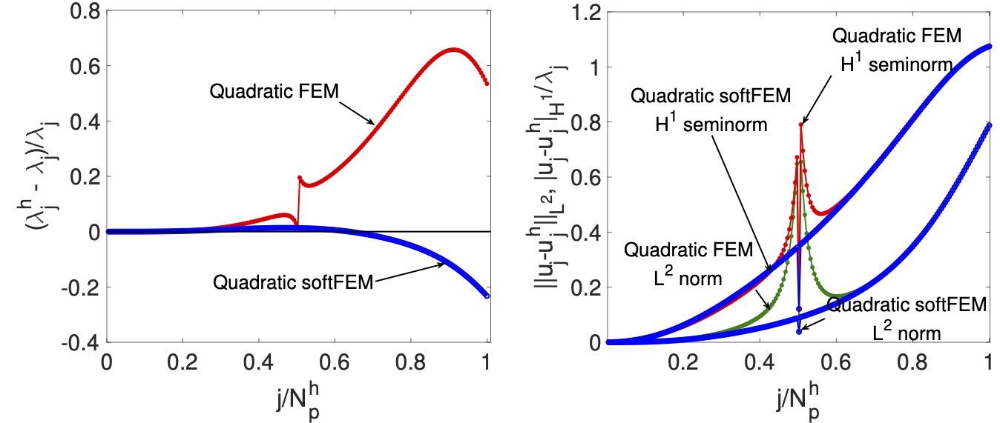 
        

    </td>
 </tr>
</table> 

* * *

**Spectral approximation with finite and isogeometric elements**  

(1) The spectral approximation by isogeometric analysis has outliers (large eigenvalue errors) in the high-frequency region. We propose a boundary penalty technique to remove the outliers and consequently reduce the stiffness (condition numbers) of the discretised system; See below a figure where the large spectral errors have been significantly reduced. See [this paper](https://www.sciencedirect.com/science/article/pii/S0045782521002449) for details. 

<table class="fixed">
  <col width="600"/>
  <col width="300"/>
  <tr>
    <td> 
        

          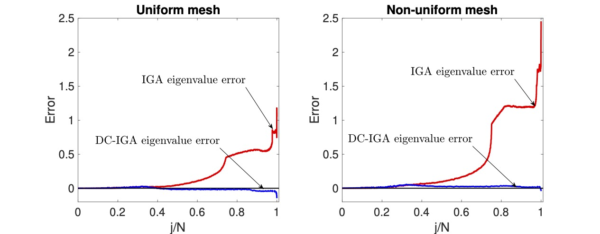 
        

    </td>
 </tr>
</table> 

(2) In general, when the domain of the model problem is irregular, the discontinuous Galerkin (DG) methods perform better than the standard FEMs. We develop a hybrid high-order (HHO) DG method to approximate the spectra of the second-order elliptic operator on irregular domains. See below the HHO approximated eigenmodes on a circular and an L-shaped domain. See [this paper](https://www.ams.org/mcom/0000-000-00/S0025-5718-2018-03405-6/) for details.

<table class="fixed">
  <col width="200"/>
  <col width="200"/>
  <tr>
    <td> 
        

          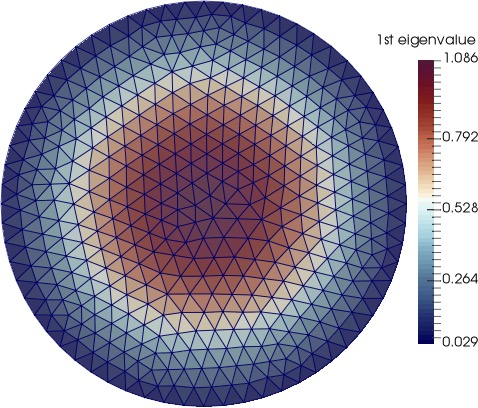 
        

    </td>
    <td> 
        

          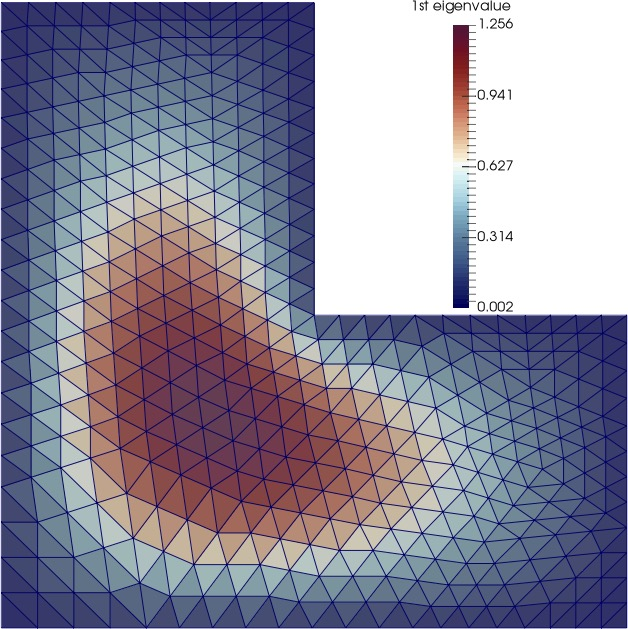 
        

    </td>
 </tr>
 <tr>
    <td> 
        

          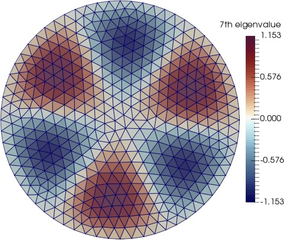 
        

    </td>
    <td> 
        

          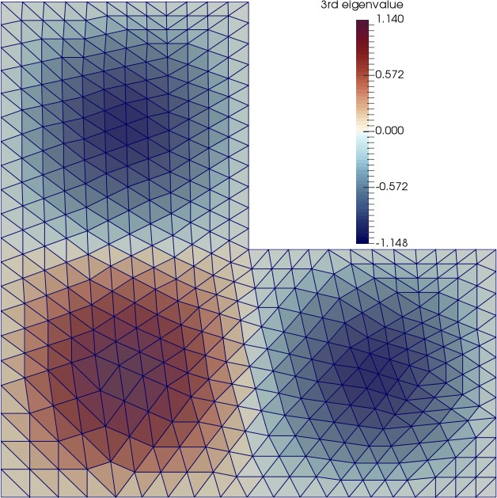 
        

    </td>
 </tr>
</table> 

* * *

**Multiphase flow simulations for flow in porous or poroelastic media**  

It is a challenging task to simulate the fluid flow through porous or poroelastic media. The main challenges are (1) complicated coupling between the Darcy fluid flow and the transport and (2) local conservative fluxes required to maintain physical saturation (bounded from 0 to 1). We develop a simulation tool based on FEMs with our local conservation postprocessing technique. See below the left column for two-phase flow through porous media while the right column for flow through poroelastic media. See [this paper](https://link.springer.com/article/10.1007/s10915-017-0493-9) for porous media while [this paper](https://www.sciencedirect.com/science/article/pii/S0021999117304692) for poroelastic media.

<table class="fixed">
  <col width="200"/>
  <col width="200"/>
  <tr>
    <td> 
        

          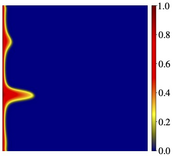 
        

    </td>
    <td> 
        

           
        

    </td>
 </tr>
 <tr>
    <td> 
        

          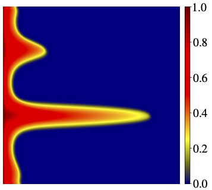 
        

    </td>
    <td> 
        

          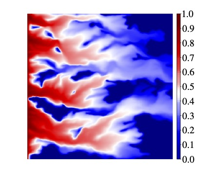 
        

    </td>
 </tr>
</table> 
  

* * *

**Superfloe parameterisation with data assimilation for sea ice dynamics**  

The discrete element method (DEM) is providing a new modeling approach for describing sea ice dynamics. It exploits particle-based methods to characterize the physical quantities of each sea ice floe along its trajectory under Lagrangian coordinates. One major challenge in applying the DEM models is the heavy computational cost when the number of floes becomes large. We develop an efficient Lagrangian parameterization algorithm to reduce the computational cost of simulating the DEM models while preserving the key features of the sea ice. The new parameterization takes advantage of a small number of artificial ice floes, named the superfloes, to effectively approximate a considerable number of the floes, where the parameterization scheme satisfies several important physics constraints. See below the figures on the superfloe parameterisation. See [this paper](https://arxiv.org/abs/2105.13569) for details. 

<table class="fixed">
  <col width="200"/>
  <col width="400"/>
  <tr>
    <td> 
        

           
        

    </td>
    <td> 
        

           
        

    </td>
 </tr>
</table> 

See below a presentation on this topic.
<iframe width="800" height="450" src="https://www.youtube.com/embed/U3MbUGe8xGY" title="YouTube video player" frameborder="0" allow="accelerometer; autoplay; clipboard-write; encrypted-media; gyroscope; picture-in-picture" allowfullscreen></iframe>

* * * *

**Isogeometric analysis of a quantum three-body problem**  

The quantum three-body problem has been well-known to be difficult to solve. We initiate the numerical study of this problem by isogeometric analysis. 
We represent the wavefunctions by linear combinations of B-spline basis functions and solve the problem as a matrix eigenvalue problem. 
The eigenvalue gives the eigenstate energy while the eigenvector gives the coefficients of the B-splines that lead to the eigenstate. 
The major difficulty of isogeometric or other finite-element-method-based analyses lies in the lack of boundary conditions and a large number of degrees of freedom required for accuracy. For a typical many-body problem with attractive interaction, there are bound and scattering states where bound states have negative eigenvalues. We focus on bound states and start with the analysis of a two-body problem. See below the figure on the first few eigenstates. See [this paper](https://arxiv.org/abs/2202.09986) for details. 

<table class="fixed">
  <col width="600"/>
  <col width="300"/>
  <tr>
    <td> 
        

          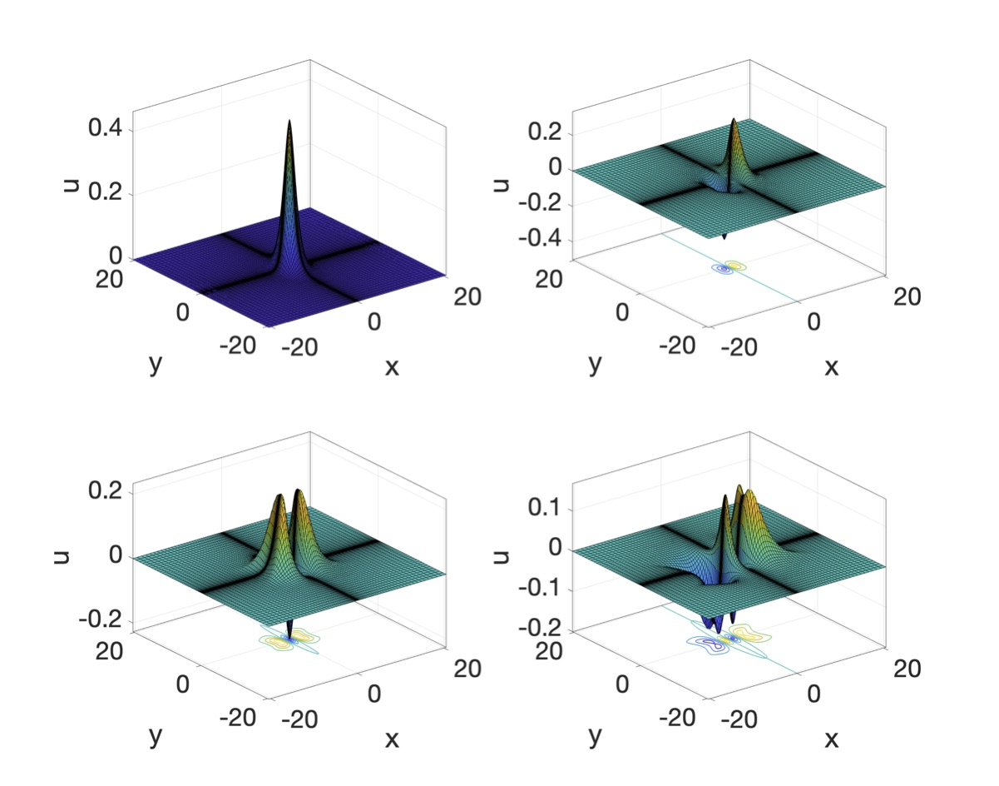 
        

    </td>
 </tr>
</table> 

* * * *

**Spectra of an unconditionally stable explicit time integrator**

We propose a new strategy for solving stiff ordinary differential equations (ODEs). We stabilize explicit schemes  in a constructive and repeatable manner. The key insight is to modify an explicit time marching scheme using Newmark's ideas and to use analysis to  discretely correct the algorithm to deliver stability. For example, we adopt the update rules from the Newmark method and apply an estimate (a constant) of the stiffness to discretely correct the forward-Euler scheme to obtain an unconditionally-stable method. The new scheme solves simultaneously for the ODE unknown and its first time-derivative.  In practice, we eliminate the time derivative and solve for the variable at the present time using the variable and its time derivate from the prior time. We then update the first-time derivative using the update rule from the Newmark method. The scheme inherits the auxiliary parameter $\beta$ from the Newmark-$\beta$ method and introduces an extra auxiliary scaling parameter $\eta$. We establish that the scheme is unconditionally-stable when $\beta>1$ and $\eta > (2\beta - 1)/\beta^2$. We also discuss a special case that delivers L-stability. The prototypical scheme is first-order accurate in time for both the ODE unknown and its first time-derivative. Using the same construction, we further correct the local truncation error of the forward Euler method to achieve a second-order scheme.  We analyze the stability and accuracy of this explicit second-order scheme. We demonstrate its accuracy and stability. Both methods have the  overall cost  of Heun's method (two-stage Runge-Kutta). See below the figure for the spectra of the scheme.

<table class="fixed">
  <col width="600"/>
  <col width="600"/>
  <tr>
    <td> 
        

          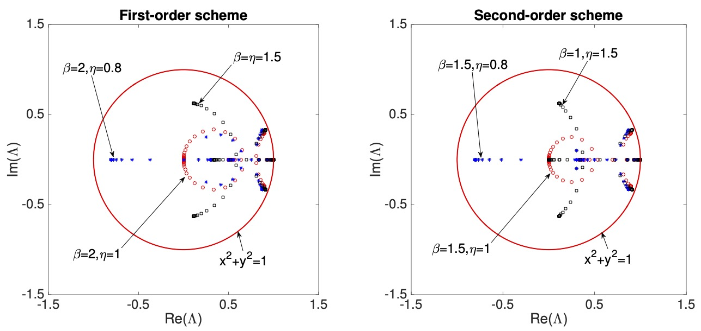 
        

    </td>
  </tr>
  <tr>
    <td> 
        

          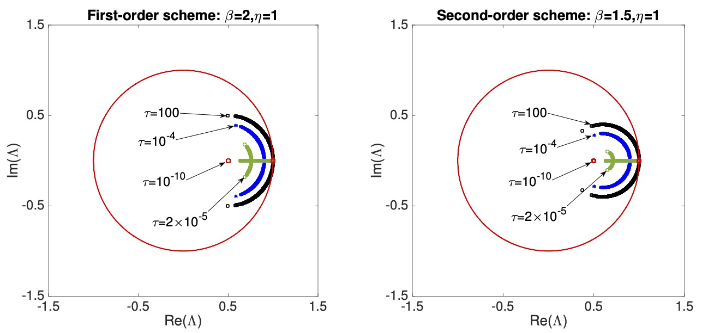 
        

    </td>
 </tr>
</table> 

